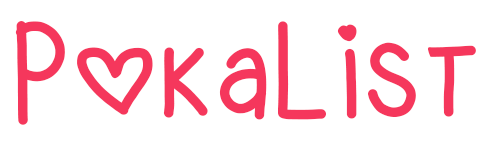

<h1 align="center">PokaList - Open Source Project</h1>

  
   
  <i>The project is simple, aimed at couples.
     Where there is a list of cool things to do with your girl or boy friend and you can finalize and add new tasks.</i>
   

## About

This simple project to practice everything I learned about Angular and also a little bit of .NET Core / C#. 
I started the project when I started my studies, so there may be some bugs and bad code :worried:
  
When I have time, I try to improve and perfect the project.

## How to use

I split the project into two parts:

### Front-end

I initially used Angular 11 where I recently migrated to 13. 
As a help, I used a template coded by [Creative Tim][creativetim]. 
<b>[Github front-end project][frontend]</b>

### Back-end

I used .NET Core 5 with EF Core and MySQL. 
<b>[Github back-end project][backend]</b>

[frontend]: https://www.meetup.com/find/?keywords=angular
[backend]: https://www.meetup.com/find/?keywords=angular
[creativetim]: https://www.creative-tim.com
